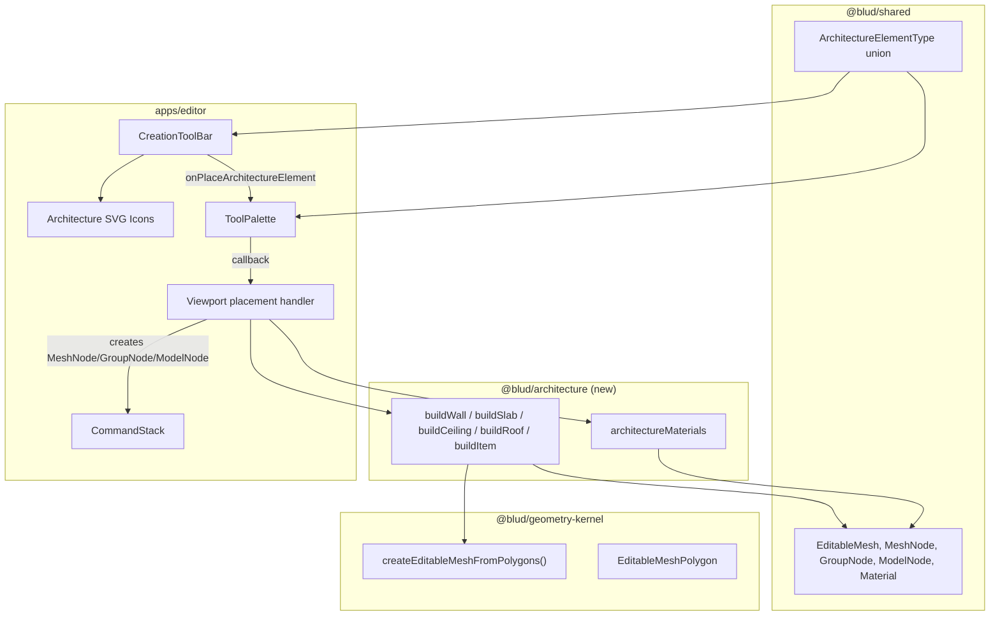

# Design Document — Extended Brush Elements (Architecture Category)

## Overview

This design adds an "Architecture" creation category to the BLUD world editor, introducing 8 building-focused elements: Wall, Slab, Ceiling, Roof, Zone, Item, Guide, and Scan. The implementation follows the established patterns from the `@blud/skatepark` package — a dedicated `packages/architecture` package exports geometry builder functions and default materials, while the editor shell integrates a new "Architecture" group into the existing `CreationToolBar`.

The four geometry elements (Wall, Slab, Ceiling, Roof) produce `EditableMesh` data via pure builder functions that call `createEditableMeshFromPolygons` from `@blud/geometry-kernel`. They are placed as `MeshNode` entries in the scene graph, reusing the existing placement flow, CommandStack integration, and serialization path. The four non-geometry elements (Zone, Item, Guide, Scan) use `GroupNode` or `ModelNode` representations with metadata conventions to distinguish them from standard nodes.

A new `ArchitectureElementType` union type in `@blud/shared` provides compile-time exhaustiveness checking across all packages that handle architecture elements.

## Architecture



### Key Design Decisions

1. **Separate `packages/architecture` package** — Mirrors the `@blud/skatepark` pattern. Geometry builders are pure functions with no editor dependency, making them independently testable and reusable outside the editor (e.g., in a CLI exporter or runtime).

2. **Geometry elements as `MeshNode`** — Wall, Slab, Ceiling, and Roof produce `EditableMesh` data and are stored as `MeshNode` entries. This gives them full mesh-edit support (extrude, bevel, subdivide) for free, matching how skatepark elements work.

3. **Non-geometry elements as `GroupNode` / `ModelNode` with metadata** — Zone and Guide use `GroupNode` with typed metadata fields (`zone.*`, `guide.*`). Scan uses `ModelNode` with `scan.reference: true` metadata. Item uses `MeshNode` with `item.*` metadata. This avoids adding new node kinds to the scene graph discriminated union, keeping serialization backward-compatible.

4. **Reuse existing placement flow** — The editor already has a pattern where `CreationToolBar` callbacks flow through `ToolPalette` → viewport handler → `CommandStack`. Architecture elements plug into this same flow via a new `onPlaceArchitectureElement` callback, identical in shape to `onPlaceSkateparkElement`.

5. **Dimension clamping over throwing** — Builder functions clamp invalid dimensions (zero/negative) to a minimum of 0.1 units rather than throwing. This matches the defensive style used throughout the editor (e.g., `clampFiniteNumber` in shared utils) and prevents runtime crashes from bad user input.

## Components and Interfaces

### 1. `@blud/shared` — Type Addition

```typescript
// Added to packages/shared/src/types.ts
export type ArchitectureElementType =
  | "wall"
  | "slab"
  | "ceiling"
  | "roof"
  | "zone"
  | "item"
  | "guide"
  | "scan";
```

Exported from `@blud/shared` alongside `SkateparkElementType`. The TypeScript compiler enforces exhaustive handling in switch/map expressions.

### 2. `@blud/architecture` — Package Structure

```
packages/architecture/
├── package.json          # @blud/architecture, deps: @blud/shared, @blud/geometry-kernel
├── tsconfig.json
└── src/
    ├── index.ts          # Re-exports all builders + materials
    ├── materials.ts      # architectureMaterials record
    └── geometry/
        ├── wall.ts       # buildWall()
        ├── slab.ts       # buildSlab()
        ├── ceiling.ts    # buildCeiling()
        ├── roof.ts       # buildRoof()
        └── item.ts       # buildItem()
```

**`package.json`** follows the `@blud/skatepark` pattern:

```json
{
  "name": "@blud/architecture",
  "version": "0.1.0",
  "type": "module",
  "sideEffects": false,
  "main": "./dist/index.js",
  "types": "./dist/index.d.ts",
  "exports": {
    ".": {
      "types": "./dist/index.d.ts",
      "import": "./dist/index.js"
    }
  },
  "scripts": {
    "build": "tsup --config ../../scripts/tsup.package.config.mjs"
  },
  "dependencies": {
    "@blud/geometry-kernel": "*",
    "@blud/shared": "*"
  }
}
```

### 3. Geometry Builder Interfaces

All geometry builders are pure functions that accept a params object and return `EditableMesh`. They follow the same signature pattern as `buildQuarterPipe`, `buildLedge`, etc.

```typescript
// wall.ts
export function buildWall(params: {
  width: number;
  height: number;
  thickness: number;
  materialId?: string;
}): EditableMesh;

// slab.ts
export function buildSlab(params: {
  width: number;
  depth: number;
  thickness: number;
  materialId?: string;
}): EditableMesh;

// ceiling.ts
export function buildCeiling(params: {
  width: number;
  depth: number;
  thickness: number;
  height: number;       // vertical offset from ground
  materialId?: string;
}): EditableMesh;

// roof.ts
export function buildRoof(params: {
  width: number;
  depth: number;
  pitchAngle: number;   // degrees, 0 = flat, clamped to 0–89
  overhang: number;
  materialId?: string;
}): EditableMesh;

// item.ts
export function buildItem(params: {
  itemType: "door" | "window" | "light-fixture";
  width: number;
  height: number;
  materialId?: string;
}): EditableMesh;
```

**Dimension clamping**: Each builder applies `Math.max(0.1, value)` to every dimension parameter before computing geometry. `buildRoof` additionally clamps `pitchAngle` to `[0, 89]`.

### 4. Materials Interface

```typescript
// materials.ts
import { type Material } from "@blud/shared";

export const architectureMaterials: Record<string, Material> = {
  "arch-wall": {
    id: "arch-wall",
    name: "Wall Default",
    color: "#C8C8C8",
    roughness: 0.8,
    metalness: 0.0
  },
  "arch-slab": {
    id: "arch-slab",
    name: "Slab Default",
    color: "#A0A0A0",
    roughness: 0.85,
    metalness: 0.0
  },
  "arch-ceiling": {
    id: "arch-ceiling",
    name: "Ceiling Default",
    color: "#E8E8E8",
    roughness: 0.7,
    metalness: 0.0
  },
  "arch-roof": {
    id: "arch-roof",
    name: "Roof Default",
    color: "#B86F50",
    roughness: 0.75,
    metalness: 0.0
  }
};
```

### 5. CreationToolBar Integration

The `CreationToolBar` component gains:
- A new `onPlaceArchitectureElement` callback prop of type `(type: ArchitectureElementType) => void`
- A new `<CreationGroup label="Architecture">` block rendered after the "Blockout" group
- 8 `<CreationButton>` entries, one per `ArchitectureElementType` value
- 8 new SVG icon components (see Requirement 14)

```typescript
// Added to CreationToolBar props
onPlaceArchitectureElement?: (type: ArchitectureElementType) => void;
```

The `ToolPalette` component is updated to:
- Accept `onPlaceArchitectureElement` in its props type
- Pass it through to `CreationToolBar`

### 6. Non-Geometry Element Metadata Conventions

**Zone** — `GroupNode` with metadata:
```typescript
{
  kind: "group",
  metadata: {
    "zone.name": string,      // e.g. "Living Room"
    "zone.usage": string       // e.g. "residential"
  }
}
```
Rendered as a wireframe bounding box (semi-transparent blue `#3B82F680`) at the node's transform position/scale.

**Guide** — `GroupNode` with metadata:
```typescript
{
  kind: "group",
  metadata: {
    "guide.axis": "x" | "y" | "z",
    "guide.offset": number,
    "guide.color": string      // e.g. "#FF6B6B"
  }
}
```
Rendered as an infinite dashed line along the specified axis. Excluded from scene export.

**Scan** — `ModelNode` with metadata:
```typescript
{
  kind: "model",
  data: { assetId: string, path: string },
  metadata: {
    "scan.reference": true
  }
}
```
Rendered at 50% opacity. Excluded from scene export.

**Item** — `MeshNode` with metadata:
```typescript
{
  kind: "mesh",
  data: EditableMesh,          // from buildItem()
  metadata: {
    "item.type": "door" | "window" | "light-fixture",
    "item.attachTo": NodeID    // optional parent wall/ceiling reference
  }
}
```

### 7. SVG Icons

Eight new icon components follow the existing pattern — functional React components accepting `{ className?: string }`, rendering `<svg>` with `viewBox="0 0 24 24"`, using `currentColor` stroke, and sized via the `size-4` Tailwind class applied by `CreationButton`.

| Element | Icon Description |
|---------|-----------------|
| Wall    | Vertical rectangle with brick-line detail |
| Slab    | Horizontal rectangle with surface hatching |
| Ceiling | Inverted horizontal rectangle with downward indicator |
| Roof    | Pitched triangle/trapezoid shape |
| Zone    | Dashed rectangle with "Z" label |
| Item    | Door/window frame outline |
| Guide   | Dashed crosshair line |
| Scan    | Point-cloud dot cluster |

## Data Models

### Scene Graph Node Representations

| Element | Node Kind | Data | Key Metadata |
|---------|-----------|------|--------------|
| Wall | `MeshNode` | `EditableMesh` from `buildWall()` | — |
| Slab | `MeshNode` | `EditableMesh` from `buildSlab()` | — |
| Ceiling | `MeshNode` | `EditableMesh` from `buildCeiling()` | — |
| Roof | `MeshNode` | `EditableMesh` from `buildRoof()` | — |
| Zone | `GroupNode` | `{}` | `zone.name`, `zone.usage` |
| Item | `MeshNode` | `EditableMesh` from `buildItem()` | `item.type`, `item.attachTo` |
| Guide | `GroupNode` | `{}` | `guide.axis`, `guide.offset`, `guide.color` |
| Scan | `ModelNode` | `ModelReference` | `scan.reference: true` |

### Default Dimensions

| Element | Default Width | Default Height/Depth | Default Thickness |
|---------|--------------|---------------------|-------------------|
| Wall | 4.0 | 3.0 (height) | 0.2 |
| Slab | 4.0 | 4.0 (depth) | 0.2 |
| Ceiling | 4.0 | 4.0 (depth) | 0.15 |
| Roof | 4.0 | 4.0 (depth) | — (pitch 30°, overhang 0.3) |
| Item (door) | 1.0 | 2.1 | — |
| Item (window) | 1.2 | 1.0 | — |

### Material Registration Flow

When an architecture element is placed:
1. The viewport handler reads `architectureMaterials` from `@blud/architecture`
2. For each material ID referenced by the element, check if it exists in the scene's material list
3. If missing, register the default material definition via the scene's material management
4. Create the `MeshNode` with the material ID assigned to all faces

### Naming Convention

Placed elements receive default names following the pattern `"Architecture: {ElementType}"`:
- `"Architecture: Wall"`
- `"Architecture: Slab"`
- `"Architecture: Ceiling"`
- `"Architecture: Roof"`
- `"Architecture: Zone"`
- `"Architecture: Item"`
- `"Architecture: Guide"`
- `"Architecture: Scan"`

### Export Exclusion

The scene exporter checks for `guide.*` and `scan.reference` metadata keys. Nodes matching these patterns are excluded from exported geometry, ensuring reference overlays don't appear in the final game build.
