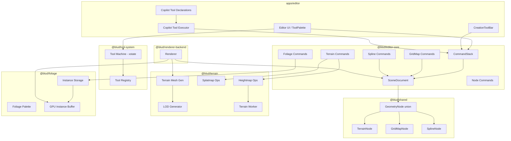

# Design Document — Worldbuilding Tools

## Overview

This design adds five worldbuilding and modeling tool categories to the BLUD world editor: **Terrain**, **Foliage/Scatter**, **GridMap**, **Advanced Splines**, and **Advanced Mesh/Modeling Tools**. Each tool integrates with the existing xstate-based tool system (`@blud/tool-system`), the `CommandStack` undo/redo system (`@blud/editor-core`), the scene graph node types (`@blud/shared`), the existing `mesh-edit` workflow, and the AI copilot tool declaration system.

The architecture follows the established monorepo patterns: domain logic lives in dedicated packages (`packages/terrain`, `packages/foliage`) and the existing geometry stack (`packages/geometry-kernel`), new node types extend the `GeometryNode` union in `@blud/shared`, commands are added to `@blud/editor-core`, and tool IDs are registered in `@blud/tool-system`. The editor UI in `apps/editor` consumes these packages and wires them into the toolbar, tool palette, inspector, viewport, and copilot. Advanced modeling intentionally extends the current `mesh-edit` tool instead of introducing a parallel modeling mode.

### Key Design Decisions

1. **Heightmap as typed array** — Terrain heightmaps use `Float32Array` for compact storage and fast Web Worker transfer via `Transferable`. This avoids JSON overhead for large grids.
2. **Sparse tile storage** — GridMap tiles use a coordinate-keyed `Map<string, TileEntry>` (key format `"x,y,z"`) for O(1) lookup regardless of grid size, matching Requirement 29.3.
3. **GPU instancing for foliage** — Foliage instances are grouped by mesh asset and rendered via a single draw call per group, with per-instance transforms in a GPU buffer.
4. **Spline mesh extrusion** — Splines generate `EditableMesh` geometry by extruding a 2D cross-section profile along the curve, reusing the existing mesh rendering pipeline.
5. **Web Worker sculpting** — Terrain heightmap modifications run on a Web Worker thread to keep the main thread responsive during sculpting (Requirement 29.1).

6. **Extend existing mesh-edit instead of replacing it** — Advanced modeling builds on `apps/editor/src/components/editor-shell/MeshEditToolBars.tsx`, `apps/editor/src/viewport/ViewportCanvas.tsx`, and `packages/geometry-kernel/src/mesh/mesh-ops/*` so the editor keeps one coherent mesh workflow.
7. **Non-destructive modifier stack for heavy modeling** — Boolean, mirror, solidify, deform, remesh, and simplify features are represented as modifier metadata on mesh data, while the evaluated result remains a cached preview artifact.
8. **Async jobs for expensive mesh processing** — Remesh, retopo, baking, and LOD generation run through worker-backed or cancellable async jobs so the viewport stays responsive on production meshes.

## Architecture



### Tool Activation Flow

All four worldbuilding tools follow the same xstate lifecycle as existing tools (`select`, `brush`, etc.):

1. User selects tool from ToolPalette or CreationToolBar
2. `Tool_System` creates a `ToolSession` with a tool-specific xstate machine
3. Pointer events drive state transitions (`idle` → `hover` → `drag` → `commit`)
4. On `commit`, the tool creates a `Command` and pushes it to the `CommandStack`
5. The `CommandStack` calls `command.execute(scene)` to mutate the `SceneDocument`

### Package Dependency Graph

```
@blud/shared          ← new node types (TerrainNode, GridMapNode, SplineNode)
@blud/terrain         ← depends on @blud/shared, three
@blud/foliage         ← depends on @blud/shared, three
@blud/editor-core     ← depends on @blud/shared, @blud/terrain, @blud/foliage
@blud/tool-system     ← depends on xstate (updated ToolId union)
apps/editor           ← depends on all of the above
```

Advanced modeling extends this dependency graph with the existing geometry and worker stack:

- `@blud/shared` gains mesh-modeling metadata for modifier stacks, PolyGroups, smoothing groups, LOD entries, and bake artifacts.
- `@blud/geometry-kernel` becomes the primary home for advanced boolean, topology, remesh, retopo, simplify, and bake helper functions.
- `@blud/editor-core` consumes those kernel ops through undoable mesh commands.
- `@blud/workers` or editor-owned worker entry points host expensive remesh, bake, and simplification jobs.

## Components and Interfaces

### 1. New Node Types (`@blud/shared`)

Three new node kinds are added to the `GeometryNode` union:

```typescript
// TerrainNode
export type TerrainLayerDefinition = {
  id: string;
  name: string;
  materialId: MaterialID;
};

export type TerrainNodeData = {
  heightmap: Float32Array;
  resolution: number; // grid is resolution × resolution
  size: Vec3;         // world extents (width, maxHeight, depth)
  splatmap: Float32Array; // resolution × resolution × maxLayers channels
  layers: TerrainLayerDefinition[];
  lodLevels: number;  // default 4
  holeMask?: Uint8Array; // 1 byte per cell, 0 = visible, 1 = hole
};

export type TerrainNode = GeometryNodeBase & {
  kind: "terrain";
  data: TerrainNodeData;
};

// GridMapNode
export type TileEntry = {
  tileId: string;
  rotation: 0 | 90 | 180 | 270;
  flipX?: boolean;
  flipZ?: boolean;
};

export type TilePaletteEntry = {
  id: string;
  name: string;
  meshAssetId: AssetID;
  hasCollision: boolean;
  hasNavMesh: boolean;
  autoTileRules?: AutoTileRule[];
};

export type AutoTileRule = {
  neighborPattern: Record<string, string | null>; // direction → expected tileId or null
  variantTileId: string;
  variantRotation: 0 | 90 | 180 | 270;
};

export type GridMapNodeData = {
  cellSize: Vec3;
  tiles: Record<string, TileEntry>; // key: "x,y,z"
  palette: TilePaletteEntry[];
};

export type GridMapNode = GeometryNodeBase & {
  kind: "gridmap";
  data: GridMapNodeData;
};

// SplineNode
export type SplineType = "road" | "fence" | "pipe" | "rail" | "cable" | "wall" | "river" | "curb";
export type SplineInterpolation = "bezier" | "catmull-rom";

export type ControlPoint = {
  position: Vec3;
  inTangent: Vec3;
  outTangent: Vec3;
};

export type CrossSectionProfile = {
  points: Vec2[];
};

export type SplineTerrainIntegration = {
  flatten: boolean;
  corridorWidth: number;
  embedDepth: number;
};

export type SplineNodeData = {
  splineType: SplineType;
  interpolation: SplineInterpolation;
  controlPoints: ControlPoint[];
  crossSection: CrossSectionProfile;
  closed: boolean;
  segmentCount: number; // mesh extrusion sampling density
  terrainIntegration?: SplineTerrainIntegration;
};

export type SplineNode = GeometryNodeBase & {
  kind: "spline";
  data: SplineNodeData;
};
```

The `GeometryNode` union is extended:

```typescript
export type GeometryNode =
  | BrushNode | GroupNode | MeshNode | ModelNode
  | PrimitiveNode | InstancingNode | LightNode
  | TerrainNode | GridMapNode | SplineNode;
```

Type guards are added:

```typescript
export function isTerrainNode(node: GeometryNode): node is TerrainNode {
  return node.kind === "terrain";
}
export function isGridMapNode(node: GeometryNode): node is GridMapNode {
  return node.kind === "gridmap";
}
export function isSplineNode(node: GeometryNode): node is SplineNode {
  return node.kind === "spline";
}
```

### 2. Terrain Package (`@blud/terrain`)

```typescript
// heightmap-ops.ts
export function applyRaiseBrush(heightmap: Float32Array, resolution: number, cx: number, cz: number, radius: number, strength: number, falloff: FalloffType): Float32Array;
export function applyLowerBrush(...): Float32Array;
export function applyFlattenBrush(heightmap: Float32Array, resolution: number, cx: number, cz: number, radius: number, strength: number, falloff: FalloffType, targetHeight: number): Float32Array;
export function applySmoothBrush(...): Float32Array;
export function applyNoiseBrush(...): Float32Array;
export function applyTerraceBrush(heightmap: Float32Array, resolution: number, cx: number, cz: number, radius: number, strength: number, falloff: FalloffType, stepHeight: number): Float32Array;
export function applyErosionBrush(...): Float32Array;

export type FalloffType = "linear" | "smooth" | "constant";
export type BrushMode = "raise" | "lower" | "flatten" | "smooth" | "noise" | "terrace" | "erosion";

// splatmap-ops.ts
export function paintSplatmapLayer(splatmap: Float32Array, resolution: number, layerCount: number, layerIndex: number, cx: number, cz: number, radius: number, strength: number, falloff: FalloffType): Float32Array;

// hole-ops.ts
export function applyHoleBrush(holeMask: Uint8Array, resolution: number, cx: number, cz: number, radius: number, value: 0 | 1): Uint8Array;

// terrain-mesh-gen.ts
export function generateTerrainMesh(heightmap: Float32Array, resolution: number, size: Vec3, holeMask?: Uint8Array): EditableMesh;
export function generateTerrainChunkMesh(heightmap: Float32Array, resolution: number, size: Vec3, chunkX: number, chunkZ: number, chunkSize: number, lodLevel: number, holeMask?: Uint8Array): EditableMesh;

// terrain-spline.ts
export function applySplineDeformation(heightmap: Float32Array, resolution: number, size: Vec3, splinePoints: Vec3[], corridorWidth: number, falloff: number, embedDepth: number): { modified: Float32Array; original: Float32Array };

// lod.ts
export function generateLodMeshes(heightmap: Float32Array, resolution: number, size: Vec3, lodLevels: number, holeMask?: Uint8Array): EditableMesh[];
```

### 3. Foliage Package (`@blud/foliage`)

```typescript
// foliage-palette.ts
export type FoliagePaletteEntry = {
  id: string;
  name: string;
  meshAssetId: AssetID;
  minScale: number;  // default 0.8
  maxScale: number;  // default 1.2
  density: number;   // instances per square unit, default 1.0
  alignToNormal: boolean;  // default true
  randomRotationY: boolean; // default true
  minSlopeAngle: number;   // degrees
  maxSlopeAngle: number;   // degrees
};

// foliage-instance.ts
export type FoliageInstance = {
  id: string;
  paletteEntryId: string;
  position: Vec3;
  rotation: Vec3;
  scale: Vec3;
};

export type FoliageInstanceStore = {
  instances: Map<string, FoliageInstance>;
  add(instance: FoliageInstance): void;
  remove(id: string): FoliageInstance | undefined;
  queryRadius(center: Vec3, radius: number): FoliageInstance[];
};

// gpu-instance-buffer.ts
export type GpuInstanceGroup = {
  meshAssetId: AssetID;
  transforms: Float32Array; // 16 floats per instance (4x4 matrix)
  count: number;
};

export function buildInstanceGroups(instances: FoliageInstance[], palette: FoliagePaletteEntry[]): GpuInstanceGroup[];
export function updateInstanceBuffer(group: GpuInstanceGroup, added: FoliageInstance[], removed: string[]): GpuInstanceGroup;
```

### 4. Tool System Updates (`@blud/tool-system`)

The `ToolId` union is extended:

```typescript
export type ToolId =
  | "select" | "transform" | "brush" | "clip" | "extrude"
  | "mesh-edit" | "path-add" | "path-edit"
  | "terrain" | "foliage" | "gridmap" | "spline-add" | "spline-edit";
```

New tool registry entries:

```typescript
{ id: "terrain", label: "Terrain" },
{ id: "foliage", label: "Foliage" },
{ id: "gridmap", label: "GridMap" },
{ id: "spline-add", label: "Add Spline" },
{ id: "spline-edit", label: "Edit Spline" },
```

Tool-specific xstate machines:

- **Terrain**: states `idle`, `sculpt`, `paint`, `hole`, `spline` with mode-selection transitions
- **Foliage**: states `idle`, `paint`, `erase` with mode toggle transitions
- **GridMap**: states `idle`, `paint`, `erase` with mode toggle transitions
- **Spline-add**: states `idle`, `placing` (sequential control point placement), `commit`
- **Spline-edit**: states `idle`, `hover`, `drag-point`, `drag-tangent`, `commit`

### 5. Editor-Core Commands (`@blud/editor-core`)

New command factory functions following the existing `createPlace*Command` pattern:

```typescript
// terrain-commands.ts
export function createPlaceTerrainNodeCommand(scene: SceneDocument, transform: Transform, data: TerrainNodeData): { command: Command; nodeId: string };
export function createSculptTerrainCommand(scene: SceneDocument, nodeId: NodeID, brushMode: BrushMode, patches: HeightmapPatch[]): Command;
export function createPaintTerrainLayerCommand(scene: SceneDocument, nodeId: NodeID, layerIndex: number, patches: SplatmapPatch[]): Command;
export function createTerrainHoleCommand(scene: SceneDocument, nodeId: NodeID, patches: HoleMaskPatch[]): Command;
export function createTerrainSplineDeformCommand(scene: SceneDocument, terrainNodeId: NodeID, originalHeightmap: Float32Array, modifiedHeightmap: Float32Array): Command;

// foliage-commands.ts
export function createPaintFoliageCommand(scene: SceneDocument, parentNodeId: NodeID, instances: FoliageInstance[]): Command;
export function createEraseFoliageCommand(scene: SceneDocument, parentNodeId: NodeID, removedInstances: FoliageInstance[]): Command;

// gridmap-commands.ts
export function createPlaceGridMapNodeCommand(scene: SceneDocument, transform: Transform, data: GridMapNodeData): { command: Command; nodeId: string };
export function createSetGridMapTilesCommand(scene: SceneDocument, nodeId: NodeID, changes: TileChange[]): Command;

// spline-commands.ts
export function createPlaceSplineNodeCommand(scene: SceneDocument, transform: Transform, data: SplineNodeData): { command: Command; nodeId: string };
export function createEditSplineCommand(scene: SceneDocument, nodeId: NodeID, oldControlPoints: ControlPoint[], newControlPoints: ControlPoint[]): Command;
export function createEditCrossSectionCommand(scene: SceneDocument, nodeId: NodeID, oldProfile: CrossSectionProfile, newProfile: CrossSectionProfile): Command;
```

### 6. Copilot Tool Declarations (`apps/editor`)

Six new declarations added to `COPILOT_TOOL_DECLARATIONS`:

| Tool Name | Parameters | Description |
|-----------|-----------|-------------|
| `place_terrain` | x, y, z, sizeX, sizeY, sizeZ, resolution, name | Creates a TerrainNode |
| `sculpt_terrain` | nodeId, brushMode, x, z, radius, strength | Applies a sculpting brush stroke |
| `paint_foliage` | surfaceNodeId, foliageTypeId, x, y, z, radius, densityOverride | Paints foliage instances |
| `place_gridmap` | x, y, z, cellX, cellY, cellZ, name | Creates a GridMapNode |
| `set_gridmap_tile` | nodeId, gridX, gridY, gridZ, tileId, rotation | Places a tile in a grid cell |
| `place_spline` | splineType, controlPoints, interpolation, terrainIntegration | Creates a SplineNode |

### 7. CreationToolBar Integration

A new `CreationGroup` labeled "Worldbuilding" is added after the "Architecture" group:

- **Create Terrain** — creates a default `TerrainNode` (256×256 resolution, 100×50×100 size) and activates the terrain tool
- **Create GridMap** — creates a default `GridMapNode` (1×1×1 cell size, empty tiles) and activates the gridmap tool
- **Spline type buttons** — one button per spline type (road, fence, pipe, rail, cable, wall, river, curb), each activates `spline-add` with the type pre-configured

### 8. Advanced Mesh/Modeling Integration (`mesh-edit`, `@blud/geometry-kernel`)

Advanced modeling is implemented as an expansion of the existing mesh-edit stack instead of a separate editor mode. The foundation is already present:

- `packages/geometry-kernel/src/mesh/mesh-ops/index.ts` exports the current mesh-op surface area.
- `packages/editor-core/src/commands/node-commands/mesh-commands.ts` already applies mesh mutations through undoable commands.
- `apps/editor/src/components/editor-shell/MeshEditToolBars.tsx` and `ToolPalette.tsx` already expose mesh editing affordances.
- `apps/editor/src/viewport/ViewportCanvas.tsx`, `apps/editor/src/viewport/types.ts`, and `apps/editor/src/viewport/editing.ts` already host mesh-edit selection, preview, and transient interaction states.

The advanced modeling expansion adds two layers on top of that base:

1. **Destructive topology tools** implemented directly in `@blud/geometry-kernel`
2. **Non-destructive modifier evaluation** stored in mesh metadata and resolved into a cached evaluated mesh for preview and apply/collapse flows

#### Advanced mesh metadata (`@blud/shared`)

```typescript
export type MeshPolyGroup = {
  id: string;
  name: string;
  color?: string;
  faceIds: FaceID[];
};

export type MeshSmoothingGroup = {
  id: string;
  name: string;
  faceIds: FaceID[];
  hardEdges?: Array<[VertexID, VertexID]>;
};

export type MeshLodEntry = {
  id: string;
  mesh: EditableMesh;
  screenSize?: number;
  triangleRatio: number;
};

export type MeshBakeArtifact = {
  id: string;
  kind: "ao" | "curvature" | "id-mask" | "normal" | "vertex-color";
  assetId?: AssetID;
  vertexColorLayer?: string;
};

export type MeshModifier =
  | { id: string; kind: "boolean"; enabled: boolean; live: boolean; operation: "difference" | "intersect" | "union"; operandNodeIds: NodeID[]; }
  | { id: string; kind: "mirror"; enabled: boolean; axis: "x" | "y" | "z"; weldThreshold?: number; }
  | { id: string; kind: "solidify"; enabled: boolean; thickness: number; offset: number; }
  | { id: string; kind: "lattice"; enabled: boolean; divisions: Vec3; cageNodeId?: NodeID; }
  | { id: string; kind: "deform"; enabled: boolean; mode: "bend" | "shear" | "taper" | "twist"; axis: "x" | "y" | "z"; amount: number; }
  | { id: string; kind: "remesh"; enabled: boolean; mode: "cleanup" | "quad" | "voxel"; density: number; }
  | { id: string; kind: "simplify"; enabled: boolean; ratio: number; preserveBorders?: boolean; };

export type EditableMeshModelingData = {
  modifiers?: MeshModifier[];
  polyGroups?: MeshPolyGroup[];
  smoothingGroups?: MeshSmoothingGroup[];
  lods?: MeshLodEntry[];
  bakeArtifacts?: MeshBakeArtifact[];
};
```

The serialized mesh data remains the canonical source mesh. Evaluated modifier results are cached in editor state and regenerated on load or invalidation, which avoids recursive mesh storage inside the scene document.

#### Geometry-kernel expansion (`packages/geometry-kernel/src/mesh/mesh-ops`)

The existing mesh-op directory gains additional modules:

```typescript
// boolean-ops.ts
export function booleanEditableMeshes(source: EditableMesh, operands: EditableMesh[], operation: "difference" | "intersect" | "union"): EditableMesh | undefined;

// inset-ops.ts
export function insetEditableMeshFaces(mesh: EditableMesh, faceIds: FaceID[], thickness: number, depth?: number): EditableMesh | undefined;

// bridge-ops.ts
export function bridgeEditableMeshLoops(mesh: EditableMesh, loopA: VertexID[], loopB: VertexID[], segments?: number, twist?: number): EditableMesh | undefined;

// knife-ops.ts
export function knifeCutEditableMesh(mesh: EditableMesh, stroke: Vec3[]): EditableMesh | undefined;

// slide-ops.ts
export function slideEditableMeshVertices(mesh: EditableMesh, vertexIds: VertexID[], amount: number): EditableMesh | undefined;
export function slideEditableMeshEdges(mesh: EditableMesh, edges: Array<[VertexID, VertexID]>, amount: number): EditableMesh | undefined;

// cleanup-ops.ts
export function weldEditableMeshVerticesByDistance(mesh: EditableMesh, tolerance: number): EditableMesh | undefined;
export function weldEditableMeshVerticesToTarget(mesh: EditableMesh, sourceVertexIds: VertexID[], targetVertexId: VertexID): EditableMesh | undefined;

// restructure-ops.ts
export function pokeEditableMeshFaces(mesh: EditableMesh, faceIds: FaceID[]): EditableMesh | undefined;
export function triangulateEditableMeshFaces(mesh: EditableMesh, faceIds?: FaceID[]): EditableMesh | undefined;
export function quadrangulateEditableMeshFaces(mesh: EditableMesh, faceIds?: FaceID[]): EditableMesh | undefined;
export function solidifyEditableMesh(mesh: EditableMesh, thickness: number, offset?: number): EditableMesh | undefined;

// remesh-ops.ts
export function voxelRemeshEditableMesh(mesh: EditableMesh, density: number): EditableMesh | undefined;
export function quadRemeshEditableMesh(mesh: EditableMesh, targetFaceCount: number): EditableMesh | undefined;
export function cleanupEditableMeshTopology(mesh: EditableMesh): EditableMesh | undefined;

// retopo-ops.ts
export function retopologizeEditableMesh(source: EditableMesh, target: EditableMesh, options: RetopoOptions): EditableMesh | undefined;

// simplify-ops.ts
export function simplifyEditableMesh(mesh: EditableMesh, ratio: number): EditableMesh | undefined;
export function generateEditableMeshLods(mesh: EditableMesh, ratios: number[]): MeshLodEntry[];

// bake-ops.ts
export function bakeEditableMeshMaps(input: MeshBakeRequest): Promise<MeshBakeResult>;
```

#### Editor-core commands (`@blud/editor-core`)

The current `mesh-commands.ts` remains for simple inflate/offset commands, while advanced modeling flows are split into dedicated command modules:

```typescript
// mesh-topology-commands.ts
export function createApplyMeshTopologyOperationCommand(scene: SceneDocument, nodeId: NodeID, before: EditableMesh, after: EditableMesh, label: string): Command;

// mesh-modifier-commands.ts
export function createSetMeshModifierStackCommand(scene: SceneDocument, nodeId: NodeID, modifiers: MeshModifier[]): Command;
export function createApplyMeshModifierCommand(scene: SceneDocument, nodeId: NodeID, modifierId: string): Command;

// mesh-group-commands.ts
export function createSetMeshPolyGroupsCommand(scene: SceneDocument, nodeId: NodeID, groups: MeshPolyGroup[]): Command;
export function createSetMeshSmoothingGroupsCommand(scene: SceneDocument, nodeId: NodeID, groups: MeshSmoothingGroup[]): Command;

// mesh-lod-commands.ts
export function createGenerateMeshLodsCommand(scene: SceneDocument, nodeId: NodeID, lods: MeshLodEntry[]): Command;

// mesh-bake-commands.ts
export function createAttachMeshBakeArtifactsCommand(scene: SceneDocument, nodeId: NodeID, artifacts: MeshBakeArtifact[]): Command;
```

#### Editor UI and viewport integration (`apps/editor`)

Advanced modeling extends the current editor files instead of adding new parallel panels:

- `apps/editor/src/components/editor-shell/MeshEditToolBars.tsx`
  Adds grouped controls for Boolean, Topology, Cleanup, Deform, Remesh/Retopo, Groups/Shading, LOD, and Bake.
- `apps/editor/src/components/editor-shell/ToolPalette.tsx`
  Surfaces context-sensitive advanced modeling controls when `activeToolId === "mesh-edit"`.
- `apps/editor/src/components/editor-shell/ToolsPanel.tsx`
  Mirrors the toolbar actions in the docked panel UI.
- `apps/editor/src/components/editor-shell/InspectorSidebar.tsx`
  Hosts modifier stack lists, PolyGroup and smoothing-group management, LOD previews, and bake outputs.
- `apps/editor/src/viewport/types.ts`
  Extends `MeshEditToolbarAction` and transient state types for boolean previews, knife strokes, loop cut previews, lattice cages, retopo overlays, and bake jobs.
- `apps/editor/src/viewport/editing.ts`
  Adds helper builders for advanced mesh handles, loop selections, symmetry pairing, and retopo snapping.
- `apps/editor/src/viewport/ViewportCanvas.tsx`
  Adds advanced modeling interaction states, overlays, modifier previews, async job progress, and apply/cancel flows.

#### Copilot declarations (`apps/editor/src/lib/copilot`)

The advanced modeling surface is exposed to the copilot as extensions of the existing mesh-edit workflow, not as a separate tool domain. `tool-declarations.ts`, `tool-executor.ts`, and `system-prompt.ts` are expanded with advanced modeling actions such as:

- `boolean_meshes`
- `inset_mesh_faces`
- `bridge_mesh_edges`
- `loop_cut_mesh`
- `knife_cut_mesh`
- `weld_mesh_vertices`
- `slide_mesh_components`
- `solidify_mesh`
- `mirror_mesh`
- `remesh_mesh`
- `retopologize_mesh`
- `assign_mesh_groups`
- `generate_mesh_lods`
- `bake_mesh_maps`

## Data Models

### Heightmap Storage

The heightmap is a flat `Float32Array` of length `resolution × resolution`, stored in row-major order. Each value represents the terrain elevation at that grid cell. The world-space position of cell `(i, j)` is:

```
worldX = node.transform.position.x + (j / (resolution - 1)) * size.x - size.x / 2
worldY = node.transform.position.y + heightmap[i * resolution + j] * size.y
worldZ = node.transform.position.z + (i / (resolution - 1)) * size.z - size.z / 2
```

### Splatmap Storage

The splatmap is a flat `Float32Array` of length `resolution × resolution × layerCount`. For cell `(i, j)` and layer `k`, the blend weight is at index `(i * resolution + j) * layerCount + k`. Weights for each cell sum to 1.0.

### Foliage Instance Storage

Foliage instances are stored as children of the surface node they were painted on. Each instance is a lightweight transform record referencing a palette entry ID. The `FoliageInstanceStore` provides spatial queries for erase operations using a flat array with linear scan (sufficient for brush-radius queries; spatial indexing can be added later if profiling shows need).

### GridMap Tile Storage

Tiles are stored in a `Record<string, TileEntry>` keyed by `"x,y,z"` coordinate strings. This provides O(1) lookup for paint/erase operations. The sparse representation means empty cells consume no storage.

### Spline Curve Evaluation

Spline curves are evaluated using either cubic Bezier or Catmull-Rom interpolation:

- **Bezier**: Each segment between control points `P0` and `P1` uses `P0.outTangent` and `P1.inTangent` as control handles
- **Catmull-Rom**: Tangents are auto-computed from neighboring control points: `tangent_i = 0.5 * (P_{i+1}.position - P_{i-1}.position)`

The mesh extrusion samples the curve at `segmentCount` evenly-spaced parameter values and sweeps the `CrossSectionProfile` along the curve, orienting each cross-section using a Frenet frame (tangent, normal, binormal).

### Advanced Mesh Modeling Storage

Advanced modeling data is stored on the source mesh as lightweight metadata:

- **Modifier stack metadata** stores modifier configuration only; the evaluated result is rebuilt on demand.
- **PolyGroups / smoothing groups** store face or edge assignments by ID, so selection and shading data survive topology-preserving edits.
- **LOD metadata** stores generated simplified meshes and switching hints as optional entries attached to the source mesh.
- **Bake artifacts** store references to generated scene assets or vertex-color layers instead of embedding large binary blobs directly in mesh topology structures.

### Serialization

All new node types and mesh-modeling metadata serialize to the `.whmap` format alongside existing nodes. `Float32Array` fields (heightmap, splatmap) are base64-encoded for JSON compatibility. `Uint8Array` (holeMask) is similarly base64-encoded. On load, these are decoded back to typed arrays. Modifier stacks, PolyGroup assignments, smoothing groups, LOD metadata, and bake artifact references serialize as structured JSON metadata on the owning mesh node.

