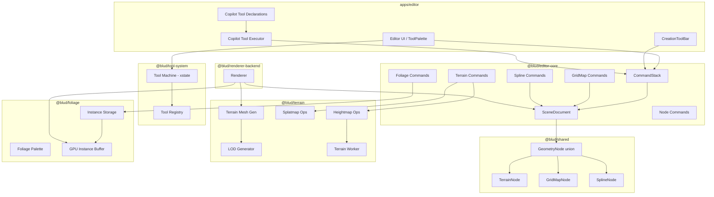

# Design Document — Worldbuilding Tools

## Overview

This design adds four worldbuilding tool categories to the BLUD world editor: **Terrain**, **Foliage/Scatter**, **GridMap**, and **Advanced Splines**. Each tool integrates with the existing xstate-based tool system (`@blud/tool-system`), the `CommandStack` undo/redo system (`@blud/editor-core`), the scene graph node types (`@blud/shared`), and the AI copilot tool declaration system.

The architecture follows the established monorepo patterns: domain logic lives in dedicated packages (`packages/terrain`, `packages/foliage`), new node types extend the `GeometryNode` union in `@blud/shared`, commands are added to `@blud/editor-core`, and tool IDs are registered in `@blud/tool-system`. The editor UI in `apps/editor` consumes these packages and wires them into the toolbar, tool palette, and copilot.

### Key Design Decisions

1. **Heightmap as typed array** — Terrain heightmaps use `Float32Array` for compact storage and fast Web Worker transfer via `Transferable`. This avoids JSON overhead for large grids.
2. **Sparse tile storage** — GridMap tiles use a coordinate-keyed `Map<string, TileEntry>` (key format `"x,y,z"`) for O(1) lookup regardless of grid size, matching Requirement 29.3.
3. **GPU instancing for foliage** — Foliage instances are grouped by mesh asset and rendered via a single draw call per group, with per-instance transforms in a GPU buffer.
4. **Spline mesh extrusion** — Splines generate `EditableMesh` geometry by extruding a 2D cross-section profile along the curve, reusing the existing mesh rendering pipeline.
5. **Web Worker sculpting** — Terrain heightmap modifications run on a Web Worker thread to keep the main thread responsive during sculpting (Requirement 29.1).

## Architecture



### Tool Activation Flow

All four worldbuilding tools follow the same xstate lifecycle as existing tools (`select`, `brush`, etc.):

1. User selects tool from ToolPalette or CreationToolBar
2. `Tool_System` creates a `ToolSession` with a tool-specific xstate machine
3. Pointer events drive state transitions (`idle` → `hover` → `drag` → `commit`)
4. On `commit`, the tool creates a `Command` and pushes it to the `CommandStack`
5. The `CommandStack` calls `command.execute(scene)` to mutate the `SceneDocument`

### Package Dependency Graph

```
@blud/shared          ← new node types (TerrainNode, GridMapNode, SplineNode)
@blud/terrain         ← depends on @blud/shared, three
@blud/foliage         ← depends on @blud/shared, three
@blud/editor-core     ← depends on @blud/shared, @blud/terrain, @blud/foliage
@blud/tool-system     ← depends on xstate (updated ToolId union)
apps/editor           ← depends on all of the above
```

## Components and Interfaces

### 1. New Node Types (`@blud/shared`)

Three new node kinds are added to the `GeometryNode` union:

```typescript
// TerrainNode
export type TerrainLayerDefinition = {
  id: string;
  name: string;
  materialId: MaterialID;
};

export type TerrainNodeData = {
  heightmap: Float32Array;
  resolution: number; // grid is resolution × resolution
  size: Vec3;         // world extents (width, maxHeight, depth)
  splatmap: Float32Array; // resolution × resolution × maxLayers channels
  layers: TerrainLayerDefinition[];
  lodLevels: number;  // default 4
  holeMask?: Uint8Array; // 1 byte per cell, 0 = visible, 1 = hole
};

export type TerrainNode = GeometryNodeBase & {
  kind: "terrain";
  data: TerrainNodeData;
};

// GridMapNode
export type TileEntry = {
  tileId: string;
  rotation: 0 | 90 | 180 | 270;
  flipX?: boolean;
  flipZ?: boolean;
};

export type TilePaletteEntry = {
  id: string;
  name: string;
  meshAssetId: AssetID;
  hasCollision: boolean;
  hasNavMesh: boolean;
  autoTileRules?: AutoTileRule[];
};

export type AutoTileRule = {
  neighborPattern: Record<string, string | null>; // direction → expected tileId or null
  variantTileId: string;
  variantRotation: 0 | 90 | 180 | 270;
};

export type GridMapNodeData = {
  cellSize: Vec3;
  tiles: Record<string, TileEntry>; // key: "x,y,z"
  palette: TilePaletteEntry[];
};

export type GridMapNode = GeometryNodeBase & {
  kind: "gridmap";
  data: GridMapNodeData;
};

// SplineNode
export type SplineType = "road" | "fence" | "pipe" | "rail" | "cable" | "wall" | "river" | "curb";
export type SplineInterpolation = "bezier" | "catmull-rom";

export type ControlPoint = {
  position: Vec3;
  inTangent: Vec3;
  outTangent: Vec3;
};

export type CrossSectionProfile = {
  points: Vec2[];
};

export type SplineTerrainIntegration = {
  flatten: boolean;
  corridorWidth: number;
  embedDepth: number;
};

export type SplineNodeData = {
  splineType: SplineType;
  interpolation: SplineInterpolation;
  controlPoints: ControlPoint[];
  crossSection: CrossSectionProfile;
  closed: boolean;
  segmentCount: number; // mesh extrusion sampling density
  terrainIntegration?: SplineTerrainIntegration;
};

export type SplineNode = GeometryNodeBase & {
  kind: "spline";
  data: SplineNodeData;
};
```

The `GeometryNode` union is extended:

```typescript
export type GeometryNode =
  | BrushNode | GroupNode | MeshNode | ModelNode
  | PrimitiveNode | InstancingNode | LightNode
  | TerrainNode | GridMapNode | SplineNode;
```

Type guards are added:

```typescript
export function isTerrainNode(node: GeometryNode): node is TerrainNode {
  return node.kind === "terrain";
}
export function isGridMapNode(node: GeometryNode): node is GridMapNode {
  return node.kind === "gridmap";
}
export function isSplineNode(node: GeometryNode): node is SplineNode {
  return node.kind === "spline";
}
```

### 2. Terrain Package (`@blud/terrain`)

```typescript
// heightmap-ops.ts
export function applyRaiseBrush(heightmap: Float32Array, resolution: number, cx: number, cz: number, radius: number, strength: number, falloff: FalloffType): Float32Array;
export function applyLowerBrush(...): Float32Array;
export function applyFlattenBrush(heightmap: Float32Array, resolution: number, cx: number, cz: number, radius: number, strength: number, falloff: FalloffType, targetHeight: number): Float32Array;
export function applySmoothBrush(...): Float32Array;
export function applyNoiseBrush(...): Float32Array;
export function applyTerraceBrush(heightmap: Float32Array, resolution: number, cx: number, cz: number, radius: number, strength: number, falloff: FalloffType, stepHeight: number): Float32Array;
export function applyErosionBrush(...): Float32Array;

export type FalloffType = "linear" | "smooth" | "constant";
export type BrushMode = "raise" | "lower" | "flatten" | "smooth" | "noise" | "terrace" | "erosion";

// splatmap-ops.ts
export function paintSplatmapLayer(splatmap: Float32Array, resolution: number, layerCount: number, layerIndex: number, cx: number, cz: number, radius: number, strength: number, falloff: FalloffType): Float32Array;

// hole-ops.ts
export function applyHoleBrush(holeMask: Uint8Array, resolution: number, cx: number, cz: number, radius: number, value: 0 | 1): Uint8Array;

// terrain-mesh-gen.ts
export function generateTerrainMesh(heightmap: Float32Array, resolution: number, size: Vec3, holeMask?: Uint8Array): EditableMesh;
export function generateTerrainChunkMesh(heightmap: Float32Array, resolution: number, size: Vec3, chunkX: number, chunkZ: number, chunkSize: number, lodLevel: number, holeMask?: Uint8Array): EditableMesh;

// terrain-spline.ts
export function applySplineDeformation(heightmap: Float32Array, resolution: number, size: Vec3, splinePoints: Vec3[], corridorWidth: number, falloff: number, embedDepth: number): { modified: Float32Array; original: Float32Array };

// lod.ts
export function generateLodMeshes(heightmap: Float32Array, resolution: number, size: Vec3, lodLevels: number, holeMask?: Uint8Array): EditableMesh[];
```

### 3. Foliage Package (`@blud/foliage`)

```typescript
// foliage-palette.ts
export type FoliagePaletteEntry = {
  id: string;
  name: string;
  meshAssetId: AssetID;
  minScale: number;  // default 0.8
  maxScale: number;  // default 1.2
  density: number;   // instances per square unit, default 1.0
  alignToNormal: boolean;  // default true
  randomRotationY: boolean; // default true
  minSlopeAngle: number;   // degrees
  maxSlopeAngle: number;   // degrees
};

// foliage-instance.ts
export type FoliageInstance = {
  id: string;
  paletteEntryId: string;
  position: Vec3;
  rotation: Vec3;
  scale: Vec3;
};

export type FoliageInstanceStore = {
  instances: Map<string, FoliageInstance>;
  add(instance: FoliageInstance): void;
  remove(id: string): FoliageInstance | undefined;
  queryRadius(center: Vec3, radius: number): FoliageInstance[];
};

// gpu-instance-buffer.ts
export type GpuInstanceGroup = {
  meshAssetId: AssetID;
  transforms: Float32Array; // 16 floats per instance (4x4 matrix)
  count: number;
};

export function buildInstanceGroups(instances: FoliageInstance[], palette: FoliagePaletteEntry[]): GpuInstanceGroup[];
export function updateInstanceBuffer(group: GpuInstanceGroup, added: FoliageInstance[], removed: string[]): GpuInstanceGroup;
```

### 4. Tool System Updates (`@blud/tool-system`)

The `ToolId` union is extended:

```typescript
export type ToolId =
  | "select" | "transform" | "brush" | "clip" | "extrude"
  | "mesh-edit" | "path-add" | "path-edit"
  | "terrain" | "foliage" | "gridmap" | "spline-add" | "spline-edit";
```

New tool registry entries:

```typescript
{ id: "terrain", label: "Terrain" },
{ id: "foliage", label: "Foliage" },
{ id: "gridmap", label: "GridMap" },
{ id: "spline-add", label: "Add Spline" },
{ id: "spline-edit", label: "Edit Spline" },
```

Tool-specific xstate machines:

- **Terrain**: states `idle`, `sculpt`, `paint`, `hole`, `spline` with mode-selection transitions
- **Foliage**: states `idle`, `paint`, `erase` with mode toggle transitions
- **GridMap**: states `idle`, `paint`, `erase` with mode toggle transitions
- **Spline-add**: states `idle`, `placing` (sequential control point placement), `commit`
- **Spline-edit**: states `idle`, `hover`, `drag-point`, `drag-tangent`, `commit`

### 5. Editor-Core Commands (`@blud/editor-core`)

New command factory functions following the existing `createPlace*Command` pattern:

```typescript
// terrain-commands.ts
export function createPlaceTerrainNodeCommand(scene: SceneDocument, transform: Transform, data: TerrainNodeData): { command: Command; nodeId: string };
export function createSculptTerrainCommand(scene: SceneDocument, nodeId: NodeID, brushMode: BrushMode, patches: HeightmapPatch[]): Command;
export function createPaintTerrainLayerCommand(scene: SceneDocument, nodeId: NodeID, layerIndex: number, patches: SplatmapPatch[]): Command;
export function createTerrainHoleCommand(scene: SceneDocument, nodeId: NodeID, patches: HoleMaskPatch[]): Command;
export function createTerrainSplineDeformCommand(scene: SceneDocument, terrainNodeId: NodeID, originalHeightmap: Float32Array, modifiedHeightmap: Float32Array): Command;

// foliage-commands.ts
export function createPaintFoliageCommand(scene: SceneDocument, parentNodeId: NodeID, instances: FoliageInstance[]): Command;
export function createEraseFoliageCommand(scene: SceneDocument, parentNodeId: NodeID, removedInstances: FoliageInstance[]): Command;

// gridmap-commands.ts
export function createPlaceGridMapNodeCommand(scene: SceneDocument, transform: Transform, data: GridMapNodeData): { command: Command; nodeId: string };
export function createSetGridMapTilesCommand(scene: SceneDocument, nodeId: NodeID, changes: TileChange[]): Command;

// spline-commands.ts
export function createPlaceSplineNodeCommand(scene: SceneDocument, transform: Transform, data: SplineNodeData): { command: Command; nodeId: string };
export function createEditSplineCommand(scene: SceneDocument, nodeId: NodeID, oldControlPoints: ControlPoint[], newControlPoints: ControlPoint[]): Command;
export function createEditCrossSectionCommand(scene: SceneDocument, nodeId: NodeID, oldProfile: CrossSectionProfile, newProfile: CrossSectionProfile): Command;
```

### 6. Copilot Tool Declarations (`apps/editor`)

Six new declarations added to `COPILOT_TOOL_DECLARATIONS`:

| Tool Name | Parameters | Description |
|-----------|-----------|-------------|
| `place_terrain` | x, y, z, sizeX, sizeY, sizeZ, resolution, name | Creates a TerrainNode |
| `sculpt_terrain` | nodeId, brushMode, x, z, radius, strength | Applies a sculpting brush stroke |
| `paint_foliage` | surfaceNodeId, foliageTypeId, x, y, z, radius, densityOverride | Paints foliage instances |
| `place_gridmap` | x, y, z, cellX, cellY, cellZ, name | Creates a GridMapNode |
| `set_gridmap_tile` | nodeId, gridX, gridY, gridZ, tileId, rotation | Places a tile in a grid cell |
| `place_spline` | splineType, controlPoints, interpolation, terrainIntegration | Creates a SplineNode |

### 7. CreationToolBar Integration

A new `CreationGroup` labeled "Worldbuilding" is added after the "Architecture" group:

- **Create Terrain** — creates a default `TerrainNode` (256×256 resolution, 100×50×100 size) and activates the terrain tool
- **Create GridMap** — creates a default `GridMapNode` (1×1×1 cell size, empty tiles) and activates the gridmap tool
- **Spline type buttons** — one button per spline type (road, fence, pipe, rail, cable, wall, river, curb), each activates `spline-add` with the type pre-configured

## Data Models

### Heightmap Storage

The heightmap is a flat `Float32Array` of length `resolution × resolution`, stored in row-major order. Each value represents the terrain elevation at that grid cell. The world-space position of cell `(i, j)` is:

```
worldX = node.transform.position.x + (j / (resolution - 1)) * size.x - size.x / 2
worldY = node.transform.position.y + heightmap[i * resolution + j] * size.y
worldZ = node.transform.position.z + (i / (resolution - 1)) * size.z - size.z / 2
```

### Splatmap Storage

The splatmap is a flat `Float32Array` of length `resolution × resolution × layerCount`. For cell `(i, j)` and layer `k`, the blend weight is at index `(i * resolution + j) * layerCount + k`. Weights for each cell sum to 1.0.

### Foliage Instance Storage

Foliage instances are stored as children of the surface node they were painted on. Each instance is a lightweight transform record referencing a palette entry ID. The `FoliageInstanceStore` provides spatial queries for erase operations using a flat array with linear scan (sufficient for brush-radius queries; spatial indexing can be added later if profiling shows need).

### GridMap Tile Storage

Tiles are stored in a `Record<string, TileEntry>` keyed by `"x,y,z"` coordinate strings. This provides O(1) lookup for paint/erase operations. The sparse representation means empty cells consume no storage.

### Spline Curve Evaluation

Spline curves are evaluated using either cubic Bezier or Catmull-Rom interpolation:

- **Bezier**: Each segment between control points `P0` and `P1` uses `P0.outTangent` and `P1.inTangent` as control handles
- **Catmull-Rom**: Tangents are auto-computed from neighboring control points: `tangent_i = 0.5 * (P_{i+1}.position - P_{i-1}.position)`

The mesh extrusion samples the curve at `segmentCount` evenly-spaced parameter values and sweeps the `CrossSectionProfile` along the curve, orienting each cross-section using a Frenet frame (tangent, normal, binormal).

### Serialization

All new node types serialize to the `.whmap` format alongside existing nodes. `Float32Array` fields (heightmap, splatmap) are base64-encoded for JSON compatibility. `Uint8Array` (holeMask) is similarly base64-encoded. On load, these are decoded back to typed arrays.

